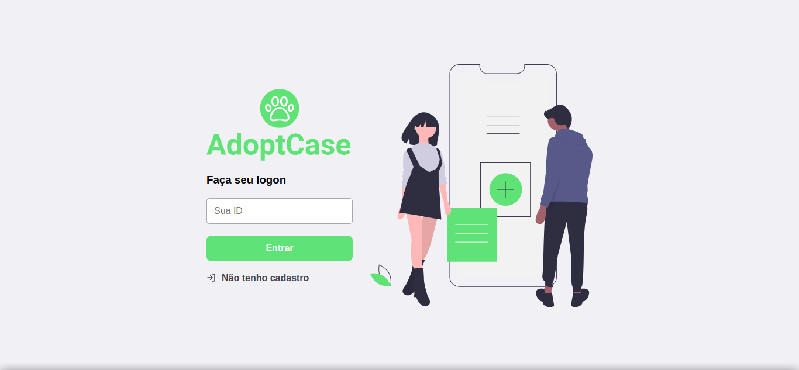
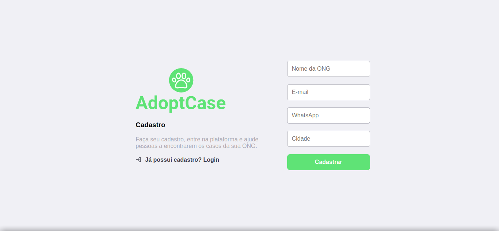
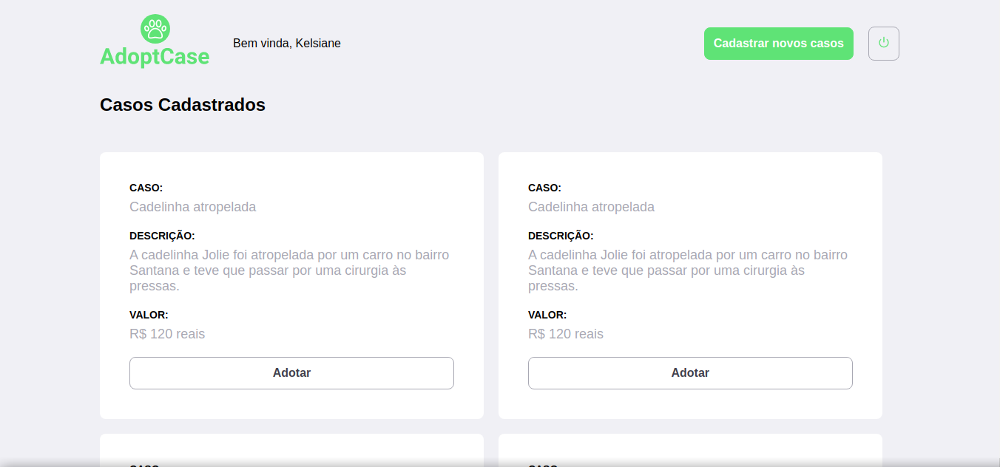
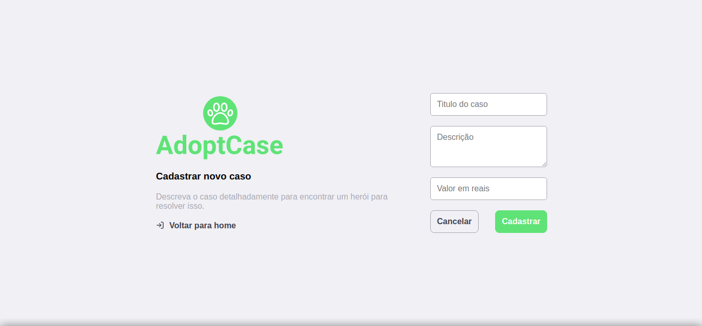

<br />
<p align="center" >
  
</p>


# :rocket: Sobre o projeto

Projeto para fins de aprendizado da biblioteca Reactjs e figma.


## :computer: Tecnologias utilizadas

- React js
- Styled Components
- Lottie
- React Router Dom
- React Icons

## :construction_worker: Projeto na sua máquina

**Primeiramente você precisa ter instalado o [Node.js](https://nodejs.org/en/download/), depois efetuar o clone deste repositório a partir do seguinte comando:**

```
https://github.com/kelsiane/adopt-case.git
```

URLs SSH fornecem acesso a um repositório Git via SSH, um protocolo seguro. Se você tiver uma chave SSH registrada em
sua conta do Github, clone o projeto usando este comando:

```
git@github.com:kelsiane/adopt-case.git
```

# :art: Layout

<br />
<p align="center">
  
</p>
<p align="center">
  
</p>
<p align="center">
  
</p>
<p align="center">
  
</p>
<br/>

# :unlock: Licença

Lançado em 2021. Este projeto está sob a licença do MIT .

Feito com muita dedicação por Kelsiane Lima :zap:
